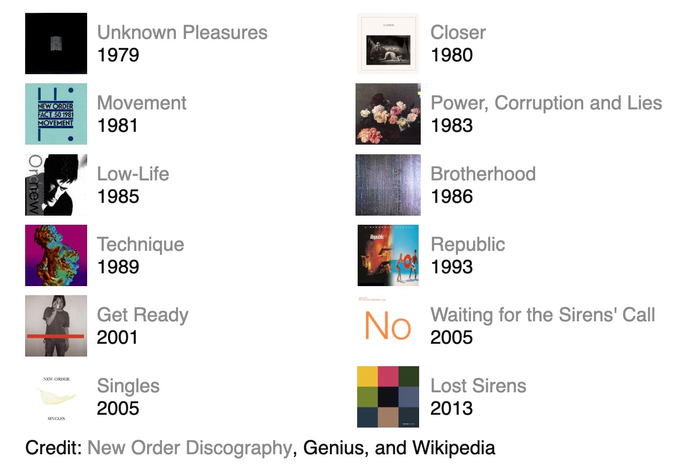
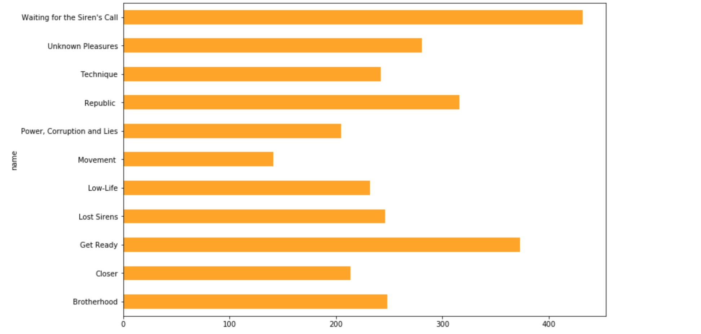
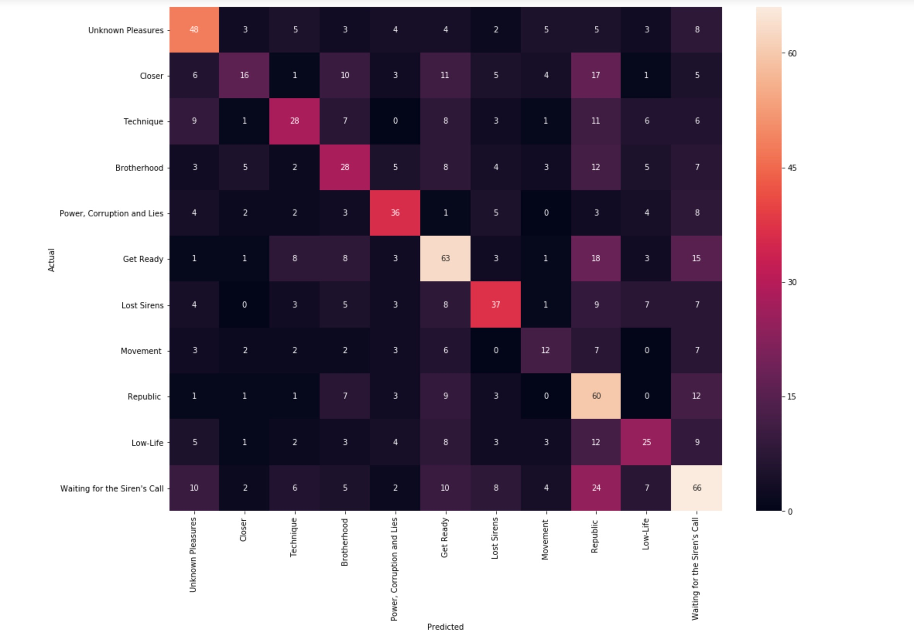

# Joy Division | New Order
Analyzing Band Lyrics for Classification and Prediction

## Table of Contents
[1.0 Directory Structure](#10-Directory-Structure)

[2.0 Project Outline / Problem Statement](#20-Project-Outline)

[3.0 Description of Data](#30-Description-of-Data)

- [3.1 Size](##31-Size)
- [3.2 Source](##32-Source)
- [3.3 Data Dictionary](##33-Data-Dictionary)

[4.0 Data Visualization](#40-Data-Visualization)

[5.0 Conclusion](#50-Conclusion)

- [5.1 Next Steps](#51-Next-Steps)

[6.0 Outside Sources](#60-Outside-Sources)

- [6.1 Inspiration](#51-Inspiration)

## 1.0 Directory Structure

```
.
├── content
├── lyrics
├── notebooks
├── NO_deck.pdf
└── README.md
```

## Directory Outline

For more details on the files within the directories, there is a `README.md` file within each subdirectory.

* *NO_deck.pdf*

  > Presentation of this project from March 13, 2020 at General Assembly, Boston MA.

* *README.md*

  > You're looking at it.

* *[content](content)*

  > Location for static images and an HTML grid of albums selected for this project.

* *[lyrics](lyrics)*

  > A top-level directory for JavaScript-Object-Notation (JSON) files obtained from the public [Genius.com WebAPI](https://docs.genius.com), code that exercises the WebAPI, and the SQLite database that supports the analysis.

* *[notebooks](notebooks)*

  > A directory for Jupyter notebooks used in this project.

## 2.0 Project Outline
Using data analytical techniques to perform natural lanaguage processing (NLP), can an model be developed that can classify individual albums? Are song lyrics attributable to a particular album? If that is possible, can machine learning "guess" song title from lyrics? 



## 3.0 Description of Data
Using the [LyricsGenius](https://github.com/johnwmillr/lyricsgenius) `search_song` function gets the web-based query held to a JSON file on disk. The query is done on a *per-track* basis for the selected artist.

### 3.1 Size
There were twelve albums and ninty-nine tracks (songs) collected by querying [genius.com](https://docs.genuis.com/) API.

### 3.2 Source
There is an example genius.com API query for **New Order**'s "5-8-6" which had to re-queried for as the original request returned a [legal document](https://en.wikipedia.org/wiki/National_Equipment_Rental,_Ltd._v._Szukhent). The output from the queries to the genius.com API were loaded into a small two-table SQLite database.

### 3.3 Data Dictionary
Not applicable for the JSON file format is a self-describing dictionary.

The SQLite database is defined as follows:
```
CREATE TABLE IF NOT EXISTS "no" (
  id integer PRIMARY KEY NOT NULL,
  artist_name char(255),
  name char(255),
  full_title char(255),
  cover_art_url char(4095),
  release_date char(30),
  artist_url char(4095),
  url char(4095)
);

CREATE TABLE IF NOT EXISTS "no_songs" (
  fk_id integer NOT NULL,
  song_id integer PRIMARY KEY NOT NULL,
  song_title char(255),
  song_lyrics char(4095),
  song_desc char(4095)
);
```
## 4.0 Data Visualization






## 5.0 Conclusion
While there is a clear diagonal line between the predicted album classification and the actual, there are still **a lot** a mis-predicted classes. In closer analysis, it appears that later albums ‘Get Ready’, ‘’Republic’, and ’Waiting for the Siren’s Call’ are more likely to capture the classification of a given lyric.
The [bar chart](./content/images/bar_albums_all.jpg) from the presentation shows these three albums having a a lyric line count over 250. This may indicate that there is an inbalance in the classification that favors late-career albums.

---
### 5.1 Next Steps
Develop a single-serving site that generates a ”card” of possible song titles for your selected album/track for the delight of fans who stumble upon the site. The design of the site would not depend on strong lyric to album classification for this end.

---
## 6.0 Outside Sources
- [Discogs - New Order](https://www.discogs.com/artist/3909-New-Order)
- [New Order Discography](http://www.niagara.edu/neworder)
- [Genius (genius.com) API Documentation](https://docs.genuis.com/)
- [LyricsGenius: A Python client for the Genius.com API](https://github.com/johnwmillr/lyricsgenius)
- [NLP concepts with spaCy](https://gist.github.com/aparrish/f21f6abbf2367e8eb23438558207e1c3)
- [ML over Taylor Swift's Lyrics](https://news.codecademy.com/taylor-swift-lyrics-machine-learning/)
- [Drake - Using NLP to Understand His Lyrics](https://towardsdatascience.com/drake-using-natural-language-processing-to-understand-his-lyrics-49e54ace3662)

### 6.1 Inspiration
- [Song Search](https://songsear.ch/)
  > "I'm looking for a song I don't know the name of…"
- [Prism | A Tool For Collaborative Interpretation of Texts](http://prism.scholarslab.org)
- [Explosion · Makers of spaCy, Prodigy, and other AI and NLP developer tools](https://explosion.ai/)
- [TextGenRNN](https://github.com/minimaxir/textgenrnn)
  > Easily train your own text-generating neural network of any size and complexity on any text dataset with a few lines of code.
